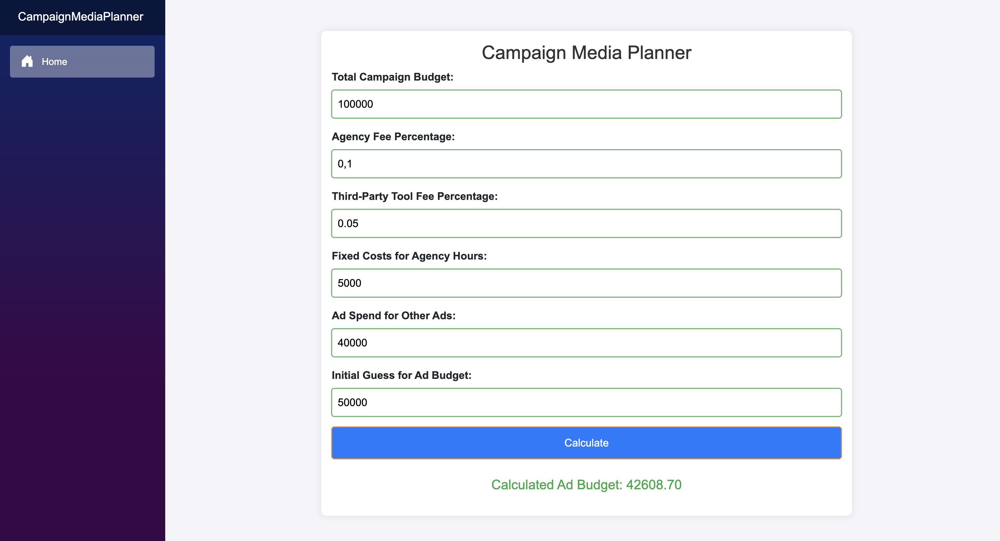

# Campaign Media Planner

## Description

This application helps optimize ad spend across various platforms to maximize the budget spent while accounting for various fees and costs.
## Layout Design


## How to Run

1. Clone the repository:
    ```sh
    git clone <repository-url>
    ```

2. Navigate to the project directory:
    ```sh
    cd CampaignMediaPlanner
    ```

3. Run the application:
    ```sh
    dotnet run
    ```

4. Open the browser and go to `http://localhost:5000`.

## How to Run Tests

Navigate to the root directory:
```sh
dotnet test
```
## Usage

- Enter the total campaign budget, agency fee percentage, third-party tool fee percentage, fixed costs for agency hours, ad spend for other ads, and an initial guess for the ad budget.
- Click the "Calculate


